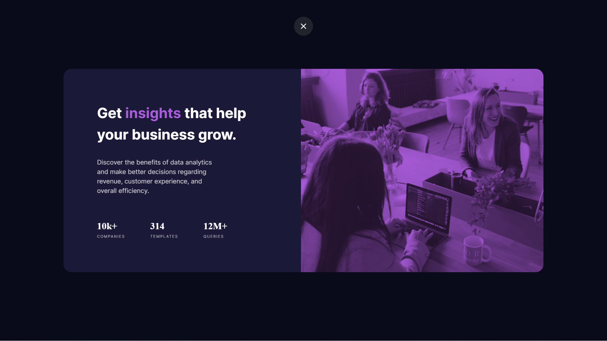
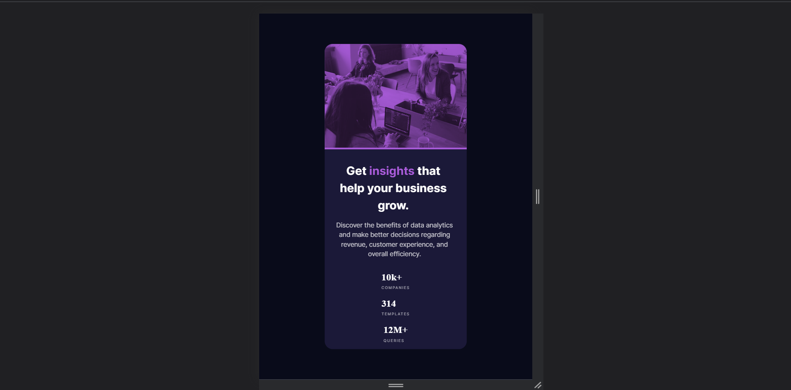

# Stats-Preview-Card-Updated

# Frontend Mentor - Stats preview card component solution

This is a solution to the [Stats preview card component challenge on Frontend Mentor](https://www.frontendmentor.io/challenges/stats-preview-card-component-8JqbgoU62). Frontend Mentor challenges help you improve your coding skills by building realistic projects. 

## Table of contents

- [Overview](#overview)
  - [The challenge](#the-challenge)
  - [Screenshot](#screenshot)
  - [Links](#links)
- [My process](#my-process)
  - [Built with](#built-with)
  - [What I learned](#what-i-learned)
  - [Continued development](#continued-development)
  - [Useful resources](#useful-resources)
- [Author](#author)

## Overview

### The challenge

Users should be able to:

- View the optimal layout depending on their device's screen size

### Screenshot




### Links

- Solution URL: [https://github.com/AmanGupta1703/Stats-Preview-Card-Updated]
- Live Site URL: [https://github.com/AmanGupta1703/Stats-Preview-Card-Updated/]

## My process

### Built with

- Semantic HTML5 markup
- CSS custom properties
- Flexbox

### What I learned

Use this section to recap over some of your major learnings while working through this project. Writing these out and providing code samples of areas you want to highlight is a great way to reinforce your own knowledge.

To see how you can add code snippets, see below:

```html
<main class="mobile-container">

    <div class="mobile-stats-item">

      <div class="mobile-stats-banner">

        

      </div>

      <div class="mobile-stats-text-content">

        <h1 class="big-heading fw-700">Get <span class="text-color-soft-violet">insights</span> that help your business grow.</h1>

        <p class="stats-description fw-400">Discover the benefits of data analytics and make better decisions regarding revenue, customer
          experience, and overall efficiency.</p>

          <div class="stats-info">

            <h2 class="fw-700">10k+ <span class="companies fw-400">companies</span></h2>
            <h2 class="fw-700">314 <span class="templates fw-400">templates</span></h2>
            <h2 class="fw-700">12M+ <span class="queries fw-400">queries</span></h2>

          </div>

      </div>

    </div>

  </main>
```
```css
.container {
    display: flex;
    justify-content: center;
}

.mobile-container {
    display: none;
}

/* Stats Item */
.stats-item {
    background-color: var(--dark-desaturated-blue-card-background);
    border-radius: 20px;
    display: flex;
    width: 80%;
}

.stats-text-content {
    padding: 7%;
    width: 50%;
}

.big-heading {
    color: var(--white-main-heading-stats);
    font-family: var(--ff-primary);
    width: 90%;
    line-height: 1.5;
}

.stats-description {
    color: var(--transparent-white-main-paragraph);
    font-size: var(--font-size);
    font-family: var(--ff-primary);
    width: 60%;
    margin: 2rem 0 0;
}

/* Stats Info */
.stats-info {
    display: flex;
    gap: 4rem;
    margin: 4rem 0 0;
}

.companies, .templates, .queries {
    color: var(--transparent-white-stat-headings);
    font-family: var(--ff-primary);
    font-size: 0.6rem;
    display: block;
    text-transform: uppercase;
    letter-spacing: 0.1rem;
}
```

### Continued development

1) FlexBox

### Useful resources

- [W3School-> FlexBox](https://www.w3schools.com/cssref/css3_pr_flex.asp)

## Author

- Website - [Stats Preview Card Updated](https://github.com/AmanGupta1703/Stats-Preview-Card-Updated)
- Frontend Mentor - [@AmanGupta1703](https://www.frontendmentor.io/profile/AmanGupta1703)
